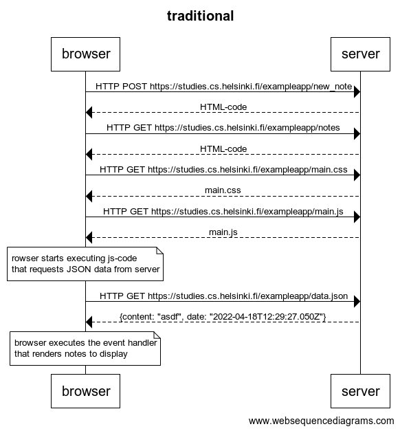
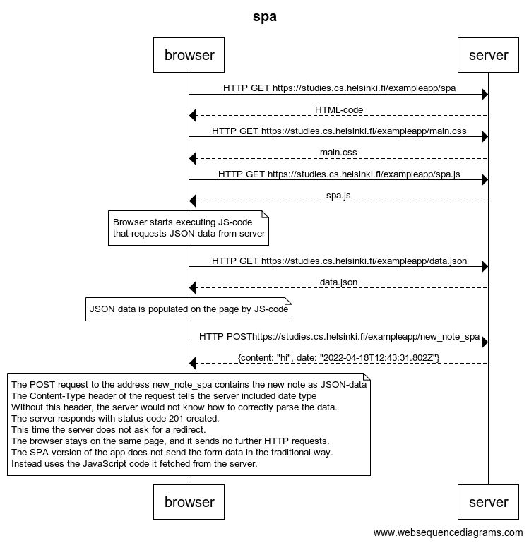

# Full Stack Open (FSO)

##Exercises 0.1.-0.6.

<code>
title traditional

browser -> server: HTTP POST https://studies.cs.helsinki.fi/exampleapp/new_note
server --> browser: HTML-code
browser -> server : HTTP GET https://studies.cs.helsinki.fi/exampleapp/notes
server --> browser: HTML-code
browser -> server: HTTP GET https://studies.cs.helsinki.fi/exampleapp/main.css
server --> browser: main.css
browser -> server: HTTP GET https://studies.cs.helsinki.fi/exampleapp/main.js
server --> browser: main.js

note over browser:
rowser starts executing js-code
that requests JSON data from server
end note

browser -> server: HTTP GET https://studies.cs.helsinki.fi/exampleapp/data.json
server --> browser: {content: "asdf", date: "2022-04-18T12:29:27.050Z"}

note over browser:
browser executes the event handler
that renders notes to display
end note
</code>

---

<code>
title spa

browser -> server: HTTP GET https://studies.cs.helsinki.fi/exampleapp/spa
server --> browser: HTML-code
browser -> server: HTTP GET https://studies.cs.helsinki.fi/exampleapp/main.css
server --> browser: main.css
browser -> server: HTTP GET https://studies.cs.helsinki.fi/exampleapp/spa.js
server --> browser: spa.js

note over browser:
Browser starts executing JS-code
that requests JSON data from server
end note

browser -> server: HTTP GET https://studies.cs.helsinki.fi/exampleapp/data.json
server --> browser: data.json

note over browser:
JSON data is populated on the page by JS-code
end note

browser -> server: HTTP POSThttps://studies.cs.helsinki.fi/exampleapp/new_note_spa
server --> browser: {content: "hi", date: "2022-04-18T12:43:31.802Z"}

note over browser:
The POST request to the address new_note_spa contains the new note as JSON-data
The Content-Type header of the request tells the server included date type
Without this header, the server would not know how to correctly parse the data.
The server responds with status code 201 created.
This time the server does not ask for a redirect.
The browser stays on the same page, and it sends no further HTTP requests.
The SPA version of the app does not send the form data in the traditional way.
Instead uses the JavaScript code it fetched from the server.
end note
</code>

